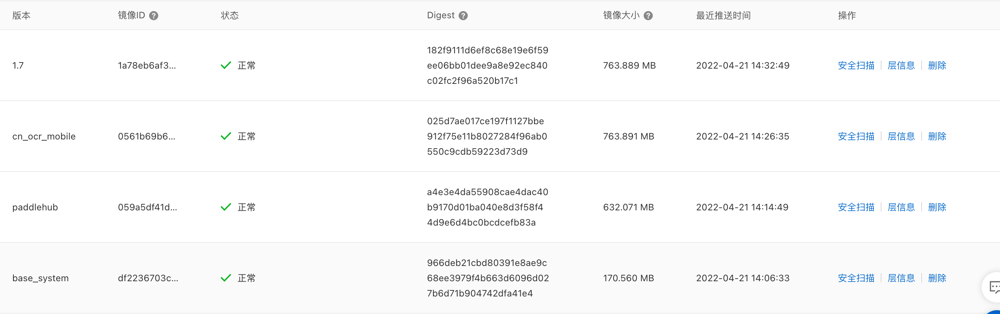

# docker构建这一篇就够了


- 简单介绍飞浆
- 通过docker构建OCR应用 
- Docker镜像瘦身技巧
- 用函数计算部署制作好的docker应用

## 目标

* 在 docker 中构建 PaddleOCR 的运行环境
* 可以在 Serverless 架构中运行(阿里云函数计算 腾讯云函数)


## 难点

* 在构建镜像方面，[飞浆官方提供的 docker 镜像](https://hub.docker.com/r/paddlepaddle/paddle/tags?page=1&ordering=last_updated)，动辄 4GB、8GB，在镜像如此大的情况下基本无缘 Serverless 。
* 深度学习的部署环境复杂依赖多


# docker 常用命令


## 创建 python 的运行环境

```
docker run -itd --name pyrun -p 9000:9000 -v 主机目录:/app python:3.7.10-slim /bin/bash
```


## 进入容器调试

```
docker exec -it pyrun  /bin/bash 
```


## 清理缓存

```
rm -rf /root/.cache/* \
&& rm -rf /var/lib/apt/lists/* \
&& rm -rf /app/test/pg/*
```


## 查看修改记录

```
docker container diff 容器名称 > 容器修改记录.log
```


## 查看层的大小

```
docker image history 镜像名称
```


## 运行中的容器大小

```
docker container ls -s
```


## 查看日志的脚本

```
docker logs testocr --tail 10 -f
```


## 镜像保存

保存为镜像

```
docker commit 容器名称 镜像名称:1.3
```

导出为文件

```
docker export -o 文件名.tar 容器名称
```

## 镜像推送

```
docker login --username=用户名 registry.cn-hongkong.aliyuncs.com

docker commit pyrun pyrun:1.0
docker tag pyrun:1.0 registry.cn-hongkong.aliyuncs.com/duolabemng/pyrun:1.0
docker push registry.cn-hongkong.aliyuncs.com/duolabemng/pyrun:1.0
```

## 清空一些无用的镜像

```py
docker system prune -af
```

安装镜像的时候发现...提示系统空间不足

通过这个命令删除了50gb的空间就可以正常安装了


# 技巧

### 依赖安装

建议先将包下载回来 然后再进行安装 避免每次都要重新下载速度慢

下载离线安装包

```
pip download -r requirements.txt -d ./pg 
pip download paddlepaddle==2.0.2 -i https://mirror.baidu.com/pypi/simple -d ./pg
pip download paddlehub -d ./pg
```

安装离线安装包

```
pip install -r requirements.txt --find-links ./pg
pip install paddlepaddle --find-links ./pg
pip install paddlehub -U --no-index --find-links ./pg
```


# 开始构建


飞浆介绍 https://www.paddlepaddle.org.cn/hub/scene/ocr

PaddleHub一键OCR中文识别 https://aistudio.baidu.com/aistudio/projectdetail/50715

[PaddleHub](https://github.com/PaddlePaddle/PaddleHub) 项目

模型说明 [chinese_ocr_db_crnn_mobile](https://github.com/PaddlePaddle/PaddleHub/tree/release/v2.2/modules/image/text_recognition/chinese_ocr_db_crnn_mobile) 


根据教程呢 我们开始写一个调试的代码


```
.
├── main.py
└── test.png

```


main.py 用于调试docker环境

```python
import paddlehub as hub
import cv2

# 加载移动端预训练模型
ocr = hub.Module(name="chinese_ocr_db_crnn_mobile")

np_images =[cv2.imread(image_path) for image_path in ['test.png']]
results = ocr.recognize_text(
                    images=np_images,         # 图片数据，ndarray.shape 为 [H, W, C]，BGR格式；
                    use_gpu=False,            # 是否使用 GPU；若使用GPU，请先设置CUDA_VISIBLE_DEVICES环境变量
                    output_dir='ocr_result',  # 图片的保存路径，默认设为 ocr_result；
                    visualization=False,       # 是否将识别结果保存为图片文件；
                    box_thresh=0.5,           # 检测文本框置信度的阈值；
                    text_thresh=0.5)          # 识别中文文本置信度的阈值；
for result in results:
    data = result['data']
    save_path = result['save_path']
    for infomation in data:
        print('text: ', infomation['text'], '\nconfidence: ', infomation['confidence'], '\ntext_box_position: ', infomation['text_box_position'])
```


`python main.py`  他会自动下载模型然后预测

```shell
/Users/chensuilong/opt/anaconda3/bin/python3 /Users/chensuilong/Desktop/ll/paddle_ocr/main.py
Download https://bj.bcebos.com/paddlehub/paddlehub_dev/chinese_ocr_db_crnn_mobile-1.1.2.tar.gz
[##################################################] 100.00%
Decompress /Users/chensuilong/.paddlehub/tmp/tmpi0gh44y4/chinese_ocr_db_crnn_mobile-1.1.2.tar.gz
[##################################################] 100.00%
[2022-04-20 21:56:41,486] [ WARNING] - Some errors occurred while installing dependent packages. Detailed error information can be found in the /Users/chensuilong/.paddlehub/log/20220420.log.
[2022-04-20 21:56:41,611] [    INFO] - Successfully installed chinese_ocr_db_crnn_mobile-1.1.2
[2022-04-20 21:56:41,615] [ WARNING] - The _initialize method in HubModule will soon be deprecated, you can use the __init__() to handle the initialization of the object
W0420 21:56:41.624859 383747584 analysis_predictor.cc:1350] Deprecated. Please use CreatePredictor instead.
Download https://bj.bcebos.com/paddlehub/paddlehub_dev/chinese_text_detection_db_mobile-1.0.4.tar.gz
[##################################################] 100.00%
Decompress /Users/chensuilong/.paddlehub/tmp/tmp10sdi16o/chinese_text_detection_db_mobile-1.0.4.tar.gz
[##################################################] 100.00%
[2022-04-20 21:58:31,500] [ WARNING] - Some errors occurred while installing dependent packages. Detailed error information can be found in the /Users/chensuilong/.paddlehub/log/20220420.log.
[2022-04-20 21:58:31,586] [    INFO] - Successfully installed chinese_text_detection_db_mobile-1.0.4
[2022-04-20 21:58:31,588] [ WARNING] - The _initialize method in HubModule will soon be deprecated, you can use the __init__() to handle the initialization of the object
text:  静夜思-百度汉语 
confidence:  0.9352425336837769 
text_box_position:  [[67, 99], [356, 44], [363, 82], [73, 135]]
text:  作者：李白 
confidence:  0.9981538653373718 
text_box_position:  [[67, 155], [201, 131], [205, 159], [72, 183]]
text:  床前明月光，疑是地上霜 
confidence:  0.9981472492218018 
text_box_position:  [[69, 193], [526, 103], [533, 145], [76, 235]]
text:  举头望明月，低头思故乡。 
confidence:  0.9937448501586914 
text_box_position:  [[67, 241], [530, 150], [536, 192], [75, 283]]

进程已结束,退出代码0

```


根据教程用这个命令行就可以直接部署成功的 

```
hub serving start -m chinese_ocr_db_crnn_mobile -p 8866
```


## 重头戏 在docker里面构建所需要的环境

## 1 基础环境和代码

```shell
docker run -itd --name pyrun -p 9000:9000 -v /Users/chensuilong/Desktop/ll/paddle_ocr:/app python:3.7.10-slim /bin/bash
docker exec -it pyrun  /bin/bash 
cd /app
python main.py
```

## 2 进入容器运行代码

```shell
docker exec -it pyrun  /bin/bash
root@74af256d692f:/# ls
app  bin  boot	dev  etc  home	lib  lib64  media  mnt	opt  proc  root  run  sbin  srv  sys  tmp  usr	var
root@74af256d692f:/# cd app/
root@74af256d692f:/app# ls
main.py  test.png
root@74af256d692f:/app# python main.py
Traceback (most recent call last):
  File "main.py", line 1, in <module>
    import paddlehub as hub
ModuleNotFoundError: No module named 'paddlehub'
```

发现缺少模块 paddlehub   那么调试的环境的代码已经准备好了 我们一步一步安装


## 安装pip包

根据上面的文档按照包 发现安装的都是最新版 那是运行不起来的

所以这里我把版本都指定好了就都可以运行了

`requirements.txt`

```
shapely==1.8.1.post1
scikit-image==0.17.2
imgaug==0.4.0
pyclipper==1.3.0.post2
lmdb==1.3.0
tqdm==4.64.0
numpy==1.21.6
visualdl==2.2.3
python-Levenshtein==0.12.2
opencv-contrib-python==4.2.0.32
paddlenlp==2.0.0
paddle2onnx==0.5.1
paddlepaddle==2.0.2
paddlehub==2.1.0

```


安装的命令

`pip3 install --no-cache-dir -r /app/requirements.txt -i https://mirror.baidu.com/pypi/simple`


安装好以上的包


`python main.py`

```
ImportError: libgomp.so.1: cannot open shared object file: No such file or directory
```

发现报错 百度 谷歌 搜索一下 `ImportError: libgomp.so.1:` 然后依次安装包

`apt update`  一下 根据我搜索的结果呢 安装一下的包就可以解决

## 安装系统依赖

需要先 `apt update`

```
apt install g++ -y
apt install libglib2.0-dev -y
apt install libgl1-mesa-glx -y
apt install libsm6 -y
apt install libxrender1 -y
apt install libgl1 -y

```


经过不断的调试终于成功了

`python main.py`

```
root@74af256d692f:/app# python main.py
/usr/local/lib/python3.7/site-packages/paddle/vision/transforms/functional_pil.py:36: DeprecationWarning: NEAREST is deprecated and will be removed in Pillow 10 (2023-07-01). Use Resampling.NEAREST or Dither.NONE instead.
  'nearest': Image.NEAREST,
/usr/local/lib/python3.7/site-packages/paddle/vision/transforms/functional_pil.py:37: DeprecationWarning: BILINEAR is deprecated and will be removed in Pillow 10 (2023-07-01). Use Resampling.BILINEAR instead.
  'bilinear': Image.BILINEAR,
/usr/local/lib/python3.7/site-packages/paddle/vision/transforms/functional_pil.py:38: DeprecationWarning: BICUBIC is deprecated and will be removed in Pillow 10 (2023-07-01). Use Resampling.BICUBIC instead.
  'bicubic': Image.BICUBIC,
/usr/local/lib/python3.7/site-packages/paddle/vision/transforms/functional_pil.py:39: DeprecationWarning: BOX is deprecated and will be removed in Pillow 10 (2023-07-01). Use Resampling.BOX instead.
  'box': Image.BOX,
/usr/local/lib/python3.7/site-packages/paddle/vision/transforms/functional_pil.py:40: DeprecationWarning: LANCZOS is deprecated and will be removed in Pillow 10 (2023-07-01). Use Resampling.LANCZOS instead.
  'lanczos': Image.LANCZOS,
/usr/local/lib/python3.7/site-packages/paddle/vision/transforms/functional_pil.py:41: DeprecationWarning: HAMMING is deprecated and will be removed in Pillow 10 (2023-07-01). Use Resampling.HAMMING instead.
  'hamming': Image.HAMMING
[2022-04-20 15:00:51,181] [ WARNING] - The _initialize method in HubModule will soon be deprecated, you can use the __init__() to handle the initialization of the object
W0420 15:00:51.188429  2256 analysis_predictor.cc:1350] Deprecated. Please use CreatePredictor instead.
[2022-04-20 15:00:51,448] [ WARNING] - The _initialize method in HubModule will soon be deprecated, you can use the __init__() to handle the initialization of the object
text:  静夜思-百度汉语
confidence:  0.9352424144744873
text_box_position:  [[67, 99], [356, 44], [363, 82], [73, 135]]
text:  作者：李白
confidence:  0.9981538653373718
text_box_position:  [[67, 155], [201, 131], [205, 159], [72, 183]]
text:  床前明月光，疑是地上霜
confidence:  0.9981472492218018
text_box_position:  [[69, 193], [526, 103], [533, 145], [76, 235]]
text:  举头望明月，低头思故乡。
confidence:  0.9937446713447571
text_box_position:  [[67, 241], [530, 150], [536, 192], [75, 283]]
```


此时运行环境已经构建好了


服务器部署Api接口 直接使用下面命令行即可

```
hub serving start -m chinese_ocr_db_crnn_mobile -p 9000
```

```
root@74af256d692f:/app# hub serving start -m chinese_ocr_db_crnn_mobile -p 9000
/usr/local/lib/python3.7/site-packages/paddle/vision/transforms/functional_pil.py:36: DeprecationWarning: NEAREST is deprecated and will be removed in Pillow 10 (2023-07-01). Use Resampling.NEAREST or Dither.NONE instead.
  'nearest': Image.NEAREST,
/usr/local/lib/python3.7/site-packages/paddle/vision/transforms/functional_pil.py:37: DeprecationWarning: BILINEAR is deprecated and will be removed in Pillow 10 (2023-07-01). Use Resampling.BILINEAR instead.
  'bilinear': Image.BILINEAR,
/usr/local/lib/python3.7/site-packages/paddle/vision/transforms/functional_pil.py:38: DeprecationWarning: BICUBIC is deprecated and will be removed in Pillow 10 (2023-07-01). Use Resampling.BICUBIC instead.
  'bicubic': Image.BICUBIC,
/usr/local/lib/python3.7/site-packages/paddle/vision/transforms/functional_pil.py:39: DeprecationWarning: BOX is deprecated and will be removed in Pillow 10 (2023-07-01). Use Resampling.BOX instead.
  'box': Image.BOX,
/usr/local/lib/python3.7/site-packages/paddle/vision/transforms/functional_pil.py:40: DeprecationWarning: LANCZOS is deprecated and will be removed in Pillow 10 (2023-07-01). Use Resampling.LANCZOS instead.
  'lanczos': Image.LANCZOS,
/usr/local/lib/python3.7/site-packages/paddle/vision/transforms/functional_pil.py:41: DeprecationWarning: HAMMING is deprecated and will be removed in Pillow 10 (2023-07-01). Use Resampling.HAMMING instead.
  'hamming': Image.HAMMING
[2022-04-20 15:08:48,389] [ WARNING] - The _initialize method in HubModule will soon be deprecated, you can use the __init__() to handle the initialization of the object
W0420 15:08:48.396706  2293 analysis_predictor.cc:1350] Deprecated. Please use CreatePredictor instead.
 * Serving Flask app 'paddlehub.serving.app_compat' (lazy loading)
 * Environment: production
   WARNING: This is a development server. Do not use it in a production deployment.
   Use a production WSGI server instead.
 * Debug mode: off
 * Running on all addresses (0.0.0.0)
   WARNING: This is a development server. Do not use it in a production deployment.
 * Running on http://127.0.0.1:9000
 * Running on http://172.17.0.2:9000 (Press CTRL+C to quit)
172.17.0.1 - - [20/Apr/2022 15:08:57] "POST /predict/ocr_system HTTP/1.1" 200 -
172.17.0.1 - - [20/Apr/2022 15:09:04] "POST /predict/ocr_system HTTP/1.1" 200 -
172.17.0.1 - - [20/Apr/2022 15:09:11] "POST /predict/ocr_system HTTP/1.1" 200 -
172.17.0.1 - - [20/Apr/2022 15:09:44] "POST /predict/chinese_ocr_db_crnn_mobile HTTP/1.1" 200 -
172.17.0.1 - - [20/Apr/2022 15:09:50] "POST /predict/chinese_ocr_db_crnn_mobile HTTP/1.1" 200 -
```


调用方法

```python
import requests
import base64

def ocr(imagePath):
    with open(imagePath, 'rb') as f:
        data = f.read(-1)
    image = str(base64.b64encode(data), encoding='utf-8')
    data = '{"images":["' + image + '"]}'
    txt = requests.post("http://127.0.0.1:9000/predict/chinese_ocr_db_crnn_mobile", data=data,
                        headers={'Content-Type': 'application/json'})
    return txt.content.decode("utf-8")

print(ocr("./test.png"))
```


```json
{"msg":"","results":[{"data":[{"confidence":0.9352424144744873,"text":"静夜思-百度汉语","text_box_position":[[67,99],[356,44],[363,82],[73,135]]},{"confidence":0.9981538653373718,"text":"作者：李白","text_box_position":[[67,155],[201,131],[205,159],[72,183]]},{"confidence":0.9981472492218018,"text":"床前明月光，疑是地上霜","text_box_position":[[69,193],[526,103],[533,145],[76,235]]},{"confidence":0.9937446713447571,"text":"举头望明月，低头思故乡。","text_box_position":[[67,241],[530,150],[536,192],[75,283]]}],"save_path":""}],"status":"000"}

```

此时部署命令也没有问题了

## 查看容器大小

我们来查看一下容器的大小 大概是 2.65GB

```shell
docker container ls -s
CONTAINER ID   IMAGE                COMMAND       CREATED          STATUS          PORTS                    NAMES     SIZE
74af256d692f   python:3.7.10-slim   "/bin/bash"   57 minutes ago   Up 57 minutes   0.0.0.0:9000->9000/tcp   pyrun     2.65GB (virtual 2.76GB)
```


观察一下新增了什么文件

```
docker container diff pyrun > 容器修改记录.log
```

观察容器的修改记录 删除不必要的文件


## 清理缓存减少容器大小

重新进入容器 `docker exec -it pyrun  /bin/bash `


```
rm -rf /root/.cache/* && rm -rf /var/lib/apt/lists/*
```

此时容器的大小变为 1.74GB

```
docker container ls -s
CONTAINER ID   IMAGE                COMMAND       CREATED             STATUS             PORTS                    NAMES     SIZE
74af256d692f   python:3.7.10-slim   "/bin/bash"   About an hour ago   Up About an hour   0.0.0.0:9000->9000/tcp   pyrun     1.74GB (virtual 1.85GB)
```


## 镜像保存和推送

```
docker login --username=duolabmeng666 registry.cn-hongkong.aliyuncs.com

docker commit pyrun pyrun:1.0
docker tag pyrun:1.0 registry.cn-hongkong.aliyuncs.com/duolabmeng/pyrun:1.0
docker push registry.cn-hongkong.aliyuncs.com/duolabmeng/pyrun:1.0
```


执行过程

```
docker login --username=duolabmeng666 registry.cn-hongkong.aliyuncs.com
Password:
Login Succeeded

docker commit pyrun pyrun:1.0
sha256:4e2b20a2457bcfeebd2f27420cc3da650d95c0bce99a482170711bf7e44df613


docker tag pyrun:1.0 registry.cn-hongkong.aliyuncs.com/duolabmeng/pyrun:1.0

docker push registry.cn-hongkong.aliyuncs.com/duolabmeng/pyrun:1.0
The push refers to repository [registry.cn-hongkong.aliyuncs.com/duolabmeng/pyrun]
8aa179f462be: Pushed
1ae70052a189: Pushed
69c309ebec0d: Pushed
49b4a6255183: Pushed
537313a13d90: Pushed
764055ebc9a7: Pushed
1.0: digest: sha256:37c2da684cd2367f4637a010eb2e468dcf80181272ab4b8e88816a64a1d9836d size: 1583
```


到这里镜像已经推送到了阿里云的容器镜像仓库了

我们可以看到 压缩后的大小是 576.587 MB


## 如何使用这个镜像呢


```
docker run -itd --name test_pyrun -p 9001:9000 registry.cn-hongkong.aliyuncs.com/duolabmeng/pyrun:1.0 /bin/bash -c "sh /app/start.sh"
```


运行 `python test_http.py`可以看到能够正常识别


```
/Users/chensuilong/opt/anaconda3/bin/python3 /Users/chensuilong/Desktop/ll/paddle_ocr/test_http.py
{"msg":"","results":[{"data":[{"confidence":0.9352424144744873,"text":"静夜思-百度汉语","text_box_position":[[67,99],[356,44],[363,82],[73,135]]},{"confidence":0.9981538653373718,"text":"作者：李白","text_box_position":[[67,155],[201,131],[205,159],[72,183]]},{"confidence":0.9981472492218018,"text":"床前明月光，疑是地上霜","text_box_position":[[69,193],[526,103],[533,145],[76,235]]},{"confidence":0.9937446713447571,"text":"举头望明月，低头思故乡。","text_box_position":[[67,241],[530,150],[536,192],[75,283]]}],"save_path":""}],"status":"000"}
```


看一下docker日志 运行正常

```
docker logs test_pyrun
/usr/local/lib/python3.7/site-packages/paddle/vision/transforms/functional_pil.py:36: DeprecationWarning: NEAREST is deprecated and will be removed in Pillow 10 (2023-07-01). Use Resampling.NEAREST or Dither.NONE instead.
  'nearest': Image.NEAREST,
/usr/local/lib/python3.7/site-packages/paddle/vision/transforms/functional_pil.py:37: DeprecationWarning: BILINEAR is deprecated and will be removed in Pillow 10 (2023-07-01). Use Resampling.BILINEAR instead.
  'bilinear': Image.BILINEAR,
/usr/local/lib/python3.7/site-packages/paddle/vision/transforms/functional_pil.py:38: DeprecationWarning: BICUBIC is deprecated and will be removed in Pillow 10 (2023-07-01). Use Resampling.BICUBIC instead.
  'bicubic': Image.BICUBIC,
/usr/local/lib/python3.7/site-packages/paddle/vision/transforms/functional_pil.py:39: DeprecationWarning: BOX is deprecated and will be removed in Pillow 10 (2023-07-01). Use Resampling.BOX instead.
  'box': Image.BOX,
/usr/local/lib/python3.7/site-packages/paddle/vision/transforms/functional_pil.py:40: DeprecationWarning: LANCZOS is deprecated and will be removed in Pillow 10 (2023-07-01). Use Resampling.LANCZOS instead.
  'lanczos': Image.LANCZOS,
/usr/local/lib/python3.7/site-packages/paddle/vision/transforms/functional_pil.py:41: DeprecationWarning: HAMMING is deprecated and will be removed in Pillow 10 (2023-07-01). Use Resampling.HAMMING instead.
  'hamming': Image.HAMMING
[2022-04-20 15:37:35,999] [ WARNING] - The _initialize method in HubModule will soon be deprecated, you can use the __init__() to handle the initialization of the object
W0420 15:37:36.007685     1 analysis_predictor.cc:1350] Deprecated. Please use CreatePredictor instead.
 * Serving Flask app 'paddlehub.serving.app_compat' (lazy loading)
 * Environment: production
   WARNING: This is a development server. Do not use it in a production deployment.
   Use a production WSGI server instead.
 * Debug mode: off
 * Running on all addresses (0.0.0.0)
   WARNING: This is a development server. Do not use it in a production deployment.
 * Running on http://127.0.0.1:9000
 * Running on http://172.17.0.3:9000 (Press CTRL+C to quit)
172.17.0.1 - - [20/Apr/2022 15:37:56] "POST /predict/chinese_ocr_db_crnn_mobile HTTP/1.1" 200 -
172.17.0.1 - - [20/Apr/2022 15:38:02] "POST /predict/chinese_ocr_db_crnn_mobile HTTP/1.1" 200 -
```


## 如何部署到阿里云函数


建立以下文件 可以到仓库里复制哈

```
.
├── Dockerfile
├── app
│   ├── app_compat.py
│   ├── index.html
│   └── start.sh
├── main.py
├── test.png
└── test_http.py

```


`Dockerfile`

```
FROM registry.cn-hongkong.aliyuncs.com/duolabmeng/pyrun:1.0

COPY app /app
WORKDIR /app
ADD /app/app_compat.py /usr/local/lib/python3.7/site-packages/paddlehub/serving/app_compat.py
EXPOSE 9000

CMD ["/bin/bash","-c","hub serving start -m chinese_ocr_db_crnn_mobile -p 9000"]


```

`start.sh`

```
#!/bin/bash
hub serving start -m chinese_ocr_db_crnn_mobile -p 9000

```


### 开始构建新的镜像

```
docker build -f ./Dockerfile -t pyrun:1.1 .
docker rm -f test_runpy
docker run -itd --name test_runpy -p 9002:9000 pyrun:1.1
docker logs ppocr
docker diff ppocr
```

测试没有问题的话就推送到阿里云镜像仓库

```
docker tag pyrun:1.1 registry.cn-hongkong.aliyuncs.com/duolabmeng/pyrun:1.3
docker push registry.cn-hongkong.aliyuncs.com/duolabmeng/pyrun:1.3
```


```
docker build -f ./Dockerfile -t paddlehub_ppocr:1.0 .
docker rm -f ppocr
docker run -itd --name ppocr -p 9000:9000 paddlehub_ppocr:1.0
docker logs ppocr
docker diff ppocr

docker tag paddlehub_ppocr:1.0 registry.cn-hongkong.aliyuncs.com/duolabmeng/ppocr:1.8
docker push registry.cn-hongkong.aliyuncs.com/duolabmeng/ppocr:1.8
```

## 本地可以运行的docker镜像放到函数计算上报错了

经过一番的折腾

## 成功了




镜像的大小大了不少

# 步骤


dockerfile文件

```
FROM python:3.7.10-slim

RUN apt update && apt install g++ libglib2.0-dev libgl1-mesa-glx libsm6 libxrender1 libgl1 -y \
     && apt-get clean && rm -rf /root/.cache/* && rm -rf /var/lib/apt/lists/*

COPY app /app
WORKDIR /app

RUN pip3 install --no-cache-dir -r /app/requirements.txt -i https://mirror.baidu.com/pypi/simple

ADD /app/app_compat.py /usr/local/lib/python3.7/site-packages/paddlehub/serving/app_compat.py

RUN hub install chinese_ocr_db_crnn_mobile

EXPOSE 9000
CMD ["/bin/bash","-c","hub serving start -m chinese_ocr_db_crnn_mobile -p 9000"]

```


由于反复试验啊 为了减少构建的时间 我分别构建了3个镜像 


* 系统的运行环境 base_system
* 飞浆的运行环境 paddlehub
* 实际应用的环境 cn_ocr_mobile


# 改进

* 升级python版本  (失败了 后续重新调试 )

本来想把python的版本升级一下的`FROM python:3.7.10-slim`改动了以后..系统依赖无法安装 所以..如果要升级py版本 那么我们需要重新开始一步一步调试 

* 升级飞浆库为 2.2.2 (没问题)

  paddle2onnx           0.9.4
  paddlehub             2.2.0
  paddlenlp             2.2.6
  paddlepaddle          2.2.2

```
shapely==1.8.1.post1
scikit-image==0.17.2
imgaug==0.4.0
pyclipper==1.3.0.post2
lmdb==1.3.0
tqdm==4.64.0
numpy==1.21.6
visualdl==2.2.3
python-Levenshtein==0.12.2
opencv-contrib-python==4.2.0.32
paddlenlp==2.2.6
paddle2onnx==0.9.4
paddlepaddle==2.2.2
paddlehub==2.2.0
```

不断的调试下出现了问题..安装不了包了..

这时候就用`docker system prune -af` 清理一下悬空的镜像 


# 

* 


